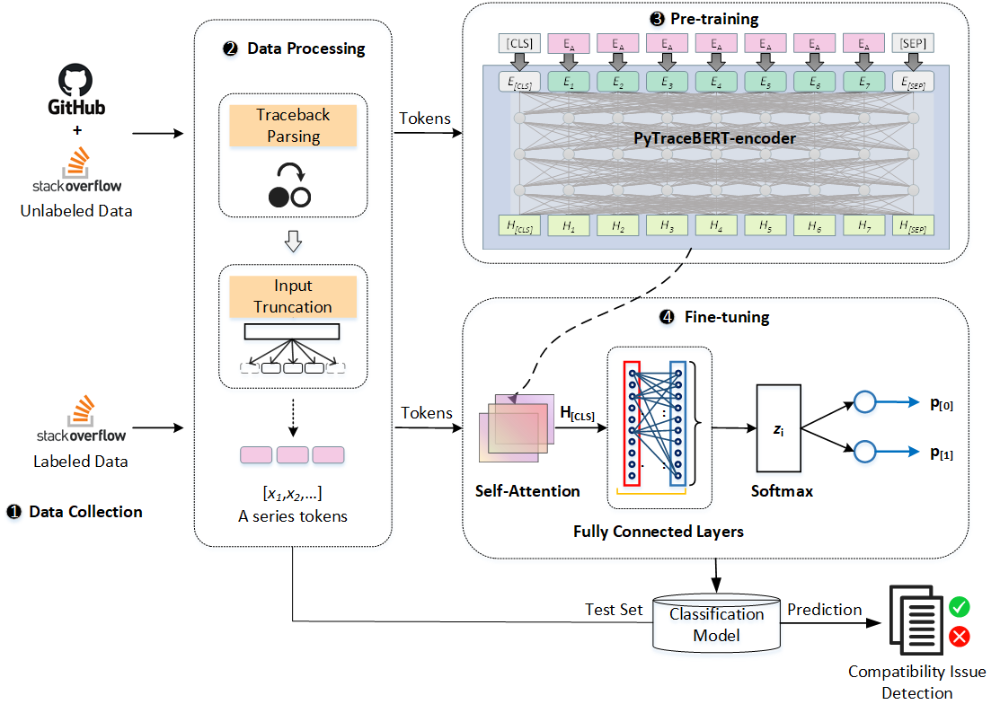

## PyTraceBERT: Python Traceback-based Language Model for Detecting Compatibility Issues in Deep Learning Systems

<div align=center>

</div>


This repository contains PyTorch implementation for PyTraceBERT: Python Traceback-based Language Model for Detecting Compatibility Issues in Deep Learning (DL) Systems.

### What is PyTraceBERT?
PyTraceBERT is a novel method that is designed to detect compatibility issues in DL systems by pre-training on a large corpus of Python traceback data. It adopts a pre-training \& fine-tuning paradigm to automatically detect DL compatibility issues from tracebacks. During the pre-training phase, PyTraceBERT performs self-supervised learning based on a large corpus of unlabeled traceback data (851,794) collected from GitHub and Stack Overflow (SO), acquiring semantic representations of tracebacks through a masked language modeling (MLM) task. We design a traceback parsing method that enables PyTraceBERT to extract more accurate traceback features. During the fine-tuning phase, we construct a classification model using the unified representation of tracebacks obtained in the pre-training phase. An attention layer is incorporated in the classification model to capture the dependencies in the traceback sequences further. Besides, we augment the positive training samples to enhance the distinguishing features between compatibility and non-compatibility issues, thereby facilitating PyTraceBERT to achieve superior performance with minimal labeled traceback data (733). 


### Dataset

---

You can download the traceback dataset [here](https://doi.org/10.5281/zenodo.13756516), which is available in the `datasets` directory. The `original traceback` subdirectory contains the original datasets, while the `pretrain` subdirectory includes the pre-training datasets after traceback parsing.

#### Pre-training Dataset

For the pre-training dataset, we collected a total of 851,794 unlabeled tracebacks from GitHub and Stack Overflow (SO). This dataset includes columns for `Traceback` and `Pattern`, with the `Pattern` column used in the same way as described below in the fine-tuning dataset.

#### Fine-tuning Dataset

For the fine-tuning dataset, we collect 733 labeled tracebacks from the dataset provided by [Wang. et al](https://doi.org/10.1145/3611643.3616321). This dataset contains the following columns: `post_id`, `Traceback`, `label`, `Pattern`, and `type`.

- **post_id**: The ID of the SO post containing the traceback.

- **label**: Binary indicator where `0` represents non-compatibility issues and `1` represents compatibility issues.

- **Pattern**: Two primary traceback formats, labeled `1` and `2`. See our paper for more details.

- **type**: One of the nine types described in [Wang et al.](https://doi.org/10.1145/3611643.3616321).

The data statistics are as follows:

| Type                          | Source       | #Tracebacks |
|-------------------------------|--------------|-------------|
| Unlabeled                     | GitHub  & SO | 881,679     |
| Labeled (Compatibility Issue)  | SO           | 141         |
| Labeled (Non-Compatibility Issue) | SO             | 592         |


### Pre-trained models

---

We have released the `PyTraceBERT` model from our paper, including both the pre-trained model and the classification model. The pre-trained model is based on [bert-base-uncased](https://huggingface.co/google-bert/bert-base-uncased) and uses the Masked Language Modeling (MLM) task for pre-training with the same mask probability as `BERT` ($p=0.15$). It can be applied to any task requiring unified traceback representation. 

Since we employed 5-fold cross-validation in our experiments, each classification model has five versions.

You can download all the models [here](https://doi.org/10.5281/zenodo.13756516), located in the `models` directory. The `pretrain` folder contains the pre-trained models, while the `task` folder contains the classification models. The primary differences between these models are the number of pre-training epochs and the training tasks, as detailed below:

- **pytracebert**: 5 epochs, MLM (this is the `PyTraceBERT` from our paper)
- **pytracebert_epoch_1**: 1 epoch, MLM
- **pytracebert_epoch_2**: 2 epochs, MLM
- **pytracebert_epoch_10**: 10 epochs, MLM
- **pytracebert_epoch_15**: 15 epochs, MLM
- **pytracebert_early_stop**: 23 epochs, MLM (early stopping applied)
- **pytracebert_FEP**: 5 epochs, MLM and FEP
- **pytracebert_SEG**: 5 epochs, MLM and SEG


### Usage

---

#### Requirements
- Python==3.8
- accelerate==0.25.0
- datasets==2.16.1
- huggingface-hub==0.24.6
- scikit-learn==1.3.2
- scipy==1.10.1
- tokenizers==0.15.2
- torch==2.2.1
- transformers==4.36.1

To install all the required packages, run the following command:

```shell
pip install -r requirements.txt
```

All experiments were conducted on an Ubuntu 20.04 server equipped with an Intel(R) Xeon(R) Platinum 8352V CPU @ 2.10GHz and NVIDIA RTX 4090 GPUs.


#### Directory structure

```markdown
PyTraceBERT 
├─data
│  ├─data_augmentation.py
├─dataset  # Datasets after traceback parsing
│  ├─Kfold  # 5-fold split datasets
│  │  ├─sep  # Separated by [SEP]
│  │  └─unsep  # Not separated by [SEP]
│  ├─pretrain  # Pre-training datasets
│  │  ├─templates_train.csv  
│  │  └─templates_train_FEP.csv  # Dataset for the pytracebert_FEP model
│  └─task  # Fine-tuning datasets 
│  │  ├─sample_20.csv  # Dataset for ChatGPT-4o
│  │  └─templates_fine_tuning.csv
├─evaluation  # Baseline code
│  ├─tokenizer
├─model  # PyTraceBERT code
├─preprocess
└─Results_of_PyTraceBERT_Paper  # Results for ChatGPT-4o
    ├─Def  # Prompts with definitions
    ├─NoDef  # Prompts without definitions
    └─gpt_prompt.xlsx
├─util      
├─fine_tuning_pytracebert.py 
├─fine_tuning_roberta.py 
├─pretrain_mlm_pytracebert.py 
├─pretrain_mlm_with_FEP.py
├─pretrain_mlm_seg.py
└─run.py

```


#### Pre-training

First, download the pre-training dataset (after traceback parsing) from [here](https://doi.org/10.5281/zenodo.13756516), located in the `pretrain` directory.

To train `PyTraceBERT`, run the following command:

```shell
python pretrain_mlm_pytracebert.py
```

To test `PyTraceBERT` with the FEP task, use:

```shell
python pretrain_mlm_with_FEP.py
```

To test `PyTraceBERT` with the SEG, use:

```shell
python pretrain_mlm_with_seg.py
```


#### Fine-tuning

To fine-tune `PyTraceBERT`, run:
```shell
python fine_tuning_pytracebert.py
```


### Baselines

---

We use `bert-base-uncased` and `roberta-base` as pre-trained baseline models. You can download [bert-base-uncased](https://huggingface.co/bert-base-uncased) and [roberta-base](https://huggingface.co/roberta-base) to your local directory.

For traditional models like CNN and BiLSTM, we utilize static [GloVe](https://doi.org/10.5281/zenodo.13756516) word embeddings.

To run the CNN or BiLSTM baselines, execute:

```shell
python run.py
```

To run BERT baselines, use the same command as for fine-tuning `PyTraceBERT`, but change the path to the pre-trained model:

```shell
python fine_tuning_pytracebert.py
```

To run RoBERTa baselines, execute:

```shell
python fine_tuning_roberta.py
```


### License

---
MIT License


